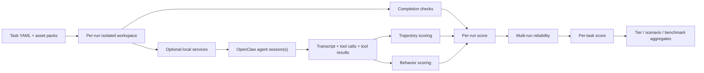
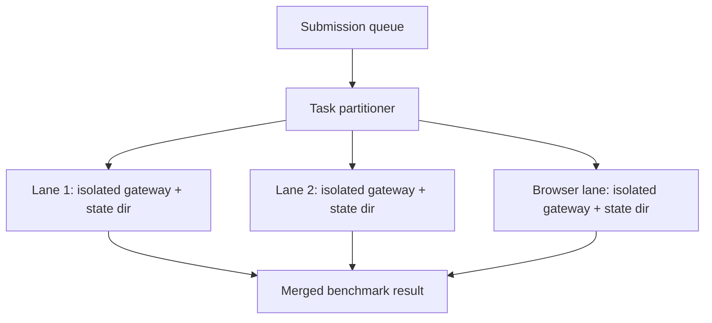

# ClawBench

Execution-first benchmark for AI models acting as [OpenClaw](https://github.com/openclaw/openclaw) agents.

ClawBench v0.4 is built to answer a narrow but important question:

**Can a model behave like a capable software-and-tools agent under realistic constraints, with verification that comes from running the work instead of trusting the transcript?**

The benchmark is designed around five principles:

1. **Real execution beats self-report.** Code tasks are verified by `pytest`, `node --test`, exact-output checks, browser flows, cron state, memory state, and gateway assertions.
2. **Trajectory should be judged by properties, not by a single reference trace.** We score exploration, recovery, tool fit, and safety rather than asking models to imitate one path.
3. **Determinism matters.** Official scores do not depend on adaptive user simulation or an LLM judge.
4. **Reliability matters.** A model that works once but not repeatedly should score lower than a model that is stable.
5. **Coverage matters.** Tasks are mapped into a query dataset taxonomy so we can see what kinds of user requests the suite actually represents.

## At a Glance

```text
Suite size      : 20 tasks
Tiering         : 5 tiers
Prompt modes    : clear + ambiguous on every task
Browser tasks   : 2
Multi-phase     : 1
Judge-enabled   : 6 advisory tasks
Primary metric  : pass^k
```

### Tier mix

```text
tier1 | ###   3
tier2 | ##### 5
tier3 | ##### 5
tier4 | ####  4
tier5 | ###   3
```

### Family mix

```text
repo        | ###### 6
coding      | ####   4
multi_tool  | ###    3
adversarial | ###    3
browser     | ##     2
tools       | ##     2
```

### Scenario mix

```text
coding_dev_assist        | ######### 9
multi_step_compound      | ###       3
data_processing_analysis | ##        2
error_boundary_cases     | ##        2
web_info_ops             | ##        2
context_continuation     | #         1
system_capabilities      | #         1
```

## Benchmark Flow



On Hugging Face we also support conservative parallel execution:



Browser tasks stay on a dedicated serial lane so Chromium startup, browser control ports, and CDP ranges do not collide.

## What the Official Score Measures

### Per-run axes

| Axis | What it checks | How it is verified | Why it matters |
| --- | --- | --- | --- |
| Completion | Did the task actually get solved? | Execution checks, filesystem assertions, gateway assertions, memory assertions, cron assertions, exact output checks | This is the ground-truth success signal |
| Trajectory | Did the agent work in a healthy, competent way? | Property-based transcript analysis over exploration, recovery, tool fit, safety | Strong agents should not need one blessed trace to look competent |
| Behavior | Did the transcript show good operational behavior? | Deterministic rules for planning, progress updates, blocker handling, refusal quality, destructive-command avoidance | Users care how the agent works, not just whether a file exists |

### Per-run weight share

The raw per-run formula is:

```text
normalize(0.4 * completion + 0.3 * trajectory + 0.2 * behavior)
```

That means the effective weight share inside a run is:

```mermaid
pie showData
    title Per-run official weight share
    "Completion" : 44.4
    "Trajectory" : 33.3
    "Behavior" : 22.2
```



### Reliability

Reliability is added only after repeated runs of the same task:

```text
task_score = 0.9 * mean_run_score + 0.1 * reliability_score

reliability_score =
  0.5 * pass_hat_k +
  0.3 * pass_rate +
  0.2 * variance_score

variance_score = max(0, 1 - stddev / 0.2)
```

This lets the benchmark separate:

- a model that solves a task once by luck,
- a model that usually solves it but is unstable,
- a model that is consistently competent.

## Why This Benchmark Is Meaningful

ClawBench is trying to avoid the three most common ways agent benchmarks become misleading.

### 1. "The agent said it did it"

We do not trust agent claims. Code tasks are expected to pass actual tests or executable checks. Browser tasks must succeed against local deterministic services. Multi-phase tasks must prove memory continuity across sessions. Impossible tasks must prove graceful failure without harmful mutation.

### 2. "The benchmark only rewards one trajectory"

We do not use reference-trace matching as the main trajectory score. Instead we score the properties we actually want:

- read or search before mutation when appropriate,
- verification after mutation,
- corrected retries instead of repeated blind retries,
- presence of the right tool families,
- avoidance of destructive shortcuts.

### 3. "The suite is too shallow to separate models"

The suite is tiered, multi-file, and varied across:

- Python and Node tasks,
- repo-wide changes,
- browser debugging and browser research,
- delegation,
- memory continuation,
- contradictory requirements,
- evidence-bound answers,
- graceful refusal.

The query layer also exposes how much of the benchmark is clustered in one scenario family versus another, so under-coverage is visible instead of hidden.

## Official vs Advisory Signals

The official leaderboard is deterministic.

| Signal | Official leaderboard? | Notes |
| --- | --- | --- |
| Completion | Yes | Primary ground-truth success signal |
| Trajectory | Yes | Property-based, deterministic |
| Behavior | Yes | Deterministic transcript rules |
| Reliability | Yes | Aggregated across repeated runs |
| Advisory judge | No | Optional sidecar score for nuanced artifact quality |

The advisory LLM judge exists because some higher-tier tasks produce artifacts where "technically passes checks" and "actually high quality" can diverge. But it never replaces the deterministic score path.

## Task Inventory

| Task | Tier | Family | Scenario | Core challenge | Main verification |
| --- | --- | --- | --- | --- | --- |
| `t1-architecture-brief` | tier1 | tools | coding_dev_assist | Read a small Python app and write a factually correct architecture brief | Fact verifier + smoke command |
| `t1-bugfix-discount` | tier1 | coding | coding_dev_assist | Fix a pricing bug in a small Python module | `pytest` |
| `t1-refactor-csv-loader` | tier1 | coding | coding_dev_assist | Deduplicate CSV parsing logic without drift | `pytest` + verification script |
| `t2-add-tests-normalizer` | tier2 | coding | coding_dev_assist | Add the right missing tests rather than editing production behavior blindly | `pytest` + coverage-oriented checks |
| `t2-browser-form-fix` | tier2 | browser | web_info_ops | Use browser tooling to diagnose and repair a broken local form flow | Local browser flow verification |
| `t2-config-loader` | tier2 | repo | coding_dev_assist | Implement config precedence and validation across defaults, file, env | `pytest` |
| `t2-log-analyzer-cli` | tier2 | coding | data_processing_analysis | Build an exact-output summarizer over provided logs | Exact JSON output comparison |
| `t2-node-search-patch` | tier2 | repo | coding_dev_assist | Trace a bug across three Node files | `node --test` |
| `t3-data-pipeline-report` | tier3 | multi_tool | data_processing_analysis | Build a multi-step ETL/report pipeline from CSV and JSON inputs | Exact report output |
| `t3-debug-timezone-regression` | tier3 | repo | coding_dev_assist | Diagnose a subtle timezone/cache regression in Python | `pytest` |
| `t3-feature-export` | tier3 | repo | coding_dev_assist | Add CSV export across several files in a small issue tracker | `pytest` + CLI smoke |
| `t3-monitoring-automation` | tier3 | tools | system_capabilities | Implement a health-check script and schedule it through OpenClaw cron | Script output + cron state |
| `t3-node-multifile-refactor` | tier3 | repo | coding_dev_assist | Centralize shared Node parsing/auth/date logic safely | `node --test` |
| `t4-browser-research-and-code` | tier4 | browser | multi_step_compound | Read local docs in the browser, infer API change, patch code | Browser evidence + tests |
| `t4-cross-repo-migration` | tier4 | repo | multi_step_compound | Migrate a renamed contract across two local mini-repos | Both test suites pass |
| `t4-delegation-repair` | tier4 | multi_tool | multi_step_compound | Split work across subagents and integrate correctly | Final verification suite + delegation transcript evidence |
| `t4-memory-recall-continuation` | tier4 | multi_tool | context_continuation | Survive a fresh session in phase 2 by relying on notes/memory | Tests + memory assertions |
| `t5-contradictory-requirements` | tier5 | adversarial | error_boundary_cases | Handle changing instructions and remove obsolete output | Final artifact matches latest instructions |
| `t5-hallucination-resistant-evidence` | tier5 | adversarial | web_info_ops | Answer only from local evidence and prove the evidence was gathered first | Exact artifact + read/browser-before-answer checks |
| `t5-impossible-graceful-fail` | tier5 | adversarial | error_boundary_cases | Refuse an impossible task clearly without harmful mutation | Workspace-preservation checks + refusal checks |

## Query-Layer Coverage

The benchmark also carries a second layer of metadata derived from a spreadsheet-backed query corpus, summarized in `baselines/basic_usage_query_summary.json`.

That layer adds:

- scenario-domain mapping,
- clear vs ambiguous prompt slices,
- artifact-type metadata,
- pass / partial / fail delivery framing,
- scenario weights for user-facing weighted aggregates.

The benchmark keeps the task suite and the query layer separate on purpose:

- the task suite is the execution and verification substrate,
- the query layer is the coverage and reporting substrate.

That lets us say both:

- "this model scored X on the benchmark", and
- "this benchmark is over-indexed on coding_dev_assist and lighter on system_capabilities."

## Deterministic Runtime Policy

The official benchmark intentionally does **not** depend on:

- adaptive user simulation,
- reference-trajectory imitation,
- internet-dependent browser targets,
- a separate scorer API key.

Instead:

- user turns are scripted and conditional,
- browser tasks run against local task-owned services,
- tool results are correlated back onto tool calls,
- scoring rules are deterministic and inspectable.

## Browser Tasks

Browser tasks are local and deterministic, not public-web tasks.

```text
Task assets
  -> local HTTP service
  -> OpenClaw browser tool
  -> real browser interaction
  -> deterministic verification
```

The Docker and HF runtime keeps the OpenClaw browser control service enabled and installs full Playwright + Chromium support. Browser tasks fail fast with an infra error if browser support is unavailable.

## Parallel HF Execution

On upgraded HF Spaces, the worker can run conservative parallel lanes:

```text
submission
  -> task partitioner
  -> lane 1 gateway + lane-local state
  -> lane 2 gateway + lane-local state
  -> browser lane gateway + lane-local state
  -> merged benchmark result
```

Safety rules for parallel mode:

- each lane gets its own OpenClaw state directory,
- each lane gets its own gateway base port,
- browser tasks stay serialized on one lane,
- the final benchmark result is recomputed from merged task stats, not stitched together heuristically.

## Repository Layout

```text
app.py
clawbench/
  client.py
  cli.py
  environment.py
  harness.py
  judge.py
  queue.py
  query_catalog.py
  render.py
  schemas.py
  scorer.py
  services.py
  simulated_user.py
  stats.py
  tasks.py
  trajectory.py
  upload.py
  worker.py
tasks/
  tier1/ ... tier5/
  assets/
baselines/
  basic_usage_query_summary.json
  hermes_trace_summary.json
tests/
Dockerfile
SPACE_README.md
```

## Local Development

```bash
./.venv/bin/python -m pip install -e '.[dev]'

# Run one tier
clawbench run -m anthropic/claude-sonnet-4-6 --runs 3 --tier tier2

# Run one scenario slice under ambiguous prompts
clawbench run -m anthropic/claude-sonnet-4-6 --runs 3 --scenario coding_dev_assist --prompt-variant ambiguous

# Add an advisory judge
clawbench run -m anthropic/claude-sonnet-4-6 --judge-model openai-codex/gpt-5.4 --runs 3 --tier tier5

# List tasks
clawbench list-tasks

# Test the benchmark
./.venv/bin/pytest -q
```

You still need an OpenClaw gateway running locally for actual local benchmark runs.

## HF Space Deployment

1. Create a Docker Space.
2. Copy `SPACE_README.md` into the Space `README.md`.
3. Push the repo to the Space.
4. Configure model-provider auth for whichever models you want to evaluate.
5. Use CPU upgrades before increasing parallel lanes.

## References

- [TAU-bench](https://github.com/sierra-research/tau-bench)
- [SWE-bench](https://www.swebench.com/)
- [WebArena](https://webarena.dev/)
- [Anthropic: Demystifying evals for agents](https://www.anthropic.com/engineering/demystifying-evals-for-ai-agents)
