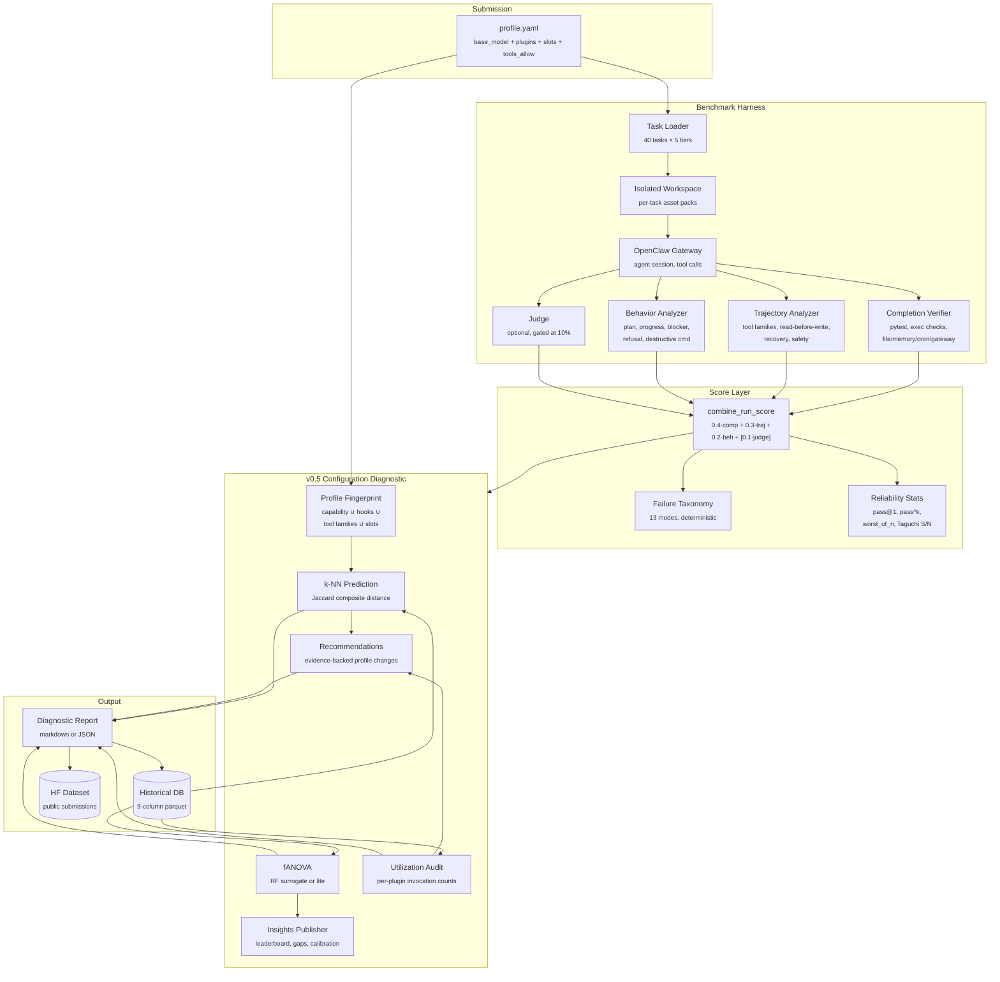
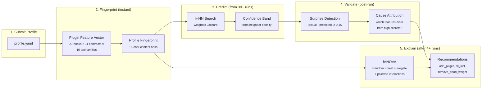

<div align="center">

# ClawBench

**The deterministic-first agent benchmark.**
Execution-verified completion. Process-quality grading. Configuration-space diagnostics.
The first agent benchmark that measures the **configuration**, not just the model.

[](https://www.python.org/downloads/)
[](LICENSE)
[](#testing)
[](#task-suite)
[](https://huggingface.co/datasets/ScoootScooob/clawbench-results)

```

                        ╔══════════════════════════════════════════╗
                        ║              C L A W B E N C H           ║
                        ║                                          ║
                        ║   deterministic │ reliable │ diagnostic  ║
                        ╚══════════════════════════════════════════╝

```

</div>

---

## Why this benchmark matters

Every agent benchmark shipping today treats the **model** as the variable and the agent as an opaque black box. Recent evidence inverts this: on realistic software-engineering tasks, swapping scaffolds produces score swings that are **an order of magnitude larger** than swapping frontier models on the same scaffold. The same Claude Sonnet beats Claude Opus when wrapped in better tooling. **The configuration is the product, not the model.**

ClawBench is built on the observation that if the configuration drives 10×+ more variance than the model, the benchmark should measure it. No other agent benchmark does.

<table>
<tr>
<th align="left">What ClawBench does</th>
<th align="left">What other benchmarks do</th>
</tr>
<tr>
<td>

- **Deterministic-first**: pass/fail by `pytest`, exit codes, exact JSON equality, DOM state assertions, network-trace checks
- **LLM judge is gated**: capped at 10% and only contributes when deterministic floor is met
- **Reliability as a first-class stat**: `pass@1`, `pass_rate`, `pass^k`, `worst_of_n`, Taguchi S/N, bootstrap CIs
- **Process quality grading**: read-before-write, self-verification, recovery after failure, tool-family fit, safety-rule violations
- **Configuration-space diagnostics**: fingerprint every plugin config, predict scores before running, explain surprises with evidence
- **Failure taxonomy**: 13 deterministic failure modes surfaced per run, not hidden in logs

</td>
<td>

- Pass rate + LLM judge in the primary path
- Single-number leaderboard, one run per task
- No distinction between a clean pass and a flaky pass
- Transcript-only scoring ("looks done" heuristics)
- All tasks public — high overfitting pressure
- Failure reported as a binary
- No visibility into *why* a configuration performed the way it did

</td>
</tr>
</table>

---

## Table of contents

- [Architecture](#architecture)
- [The three-layer scoring model](#the-three-layer-scoring-model)
- [v0.5 Configuration Diagnostic](#v05-configuration-diagnostic)
- [Mathematical pillars](#mathematical-pillars)
- [Quick start](#quick-start)
- [Recent results: 7-model frontier baseline](#recent-results-7-model-frontier-baseline)
- [Task suite](#task-suite)
- [Scoring model](#scoring-model)
- [CLI reference](#cli-reference)
- [Repository layout](#repository-layout)
- [How ClawBench compares to other benchmarks](#how-clawbench-compares-to-other-benchmarks)
- [Contributing](#contributing)

---

## Architecture



---

## The three-layer scoring model

ClawBench separates *whether the work got done* from *how it got done* from *how good the semantic residue is*. These three layers are **never collapsed** before reporting:

### Layer A — Core Deterministic (primary leaderboard)

Binary pass/fail plus partial credit from deterministic sub-assertions. This is the source of truth for every official score.

| Verifier kind | What it checks |
|---|---|
| `execution` | `pytest`, `node --test`, shell exit codes, stdout/stderr matching |
| `exact` | Exact string, JSON, or file-content equality |
| `normalized_structural` | Canonicalized JSON comparison, file-tree equality |
| `state_transition` | Memory entries, cron state, gateway state, session state |
| `trace_based` | DOM assertions, network-trace assertions, tool-call sequence checks |

No LLM judging is allowed as a primary verifier when deterministic verification is possible. This is enforced in [`clawbench/scorer.py:176`](clawbench/scorer.py) — judge contribution is capped at 10% and only unlocked when `completion.score ≥ 0.9999`.

### Layer B — Process and Robustness (first-class, reported separately)

Did the agent work the way we want? Measured entirely from the tool-call sequence and transcript:

- **Read-before-write** ratio (exploration before mutation)
- **Self-verification** after mutations
- **Recovery** after failures (did the agent retry intelligently?)
- **Tool-family fit** (was the right tool reached for?)
- **Unsafe behavior penalties** (destructive commands, forbidden patterns)

Secondary to hard completion — never rescues a failed pass — but always published alongside.

### Layer C — Semantic Quality (irreducible residue only)

Restricted to tasks where execution cannot fully capture quality: architecture briefs, incident summaries, research memos, code reviews. Uses a 3-judge ensemble from different model families, rubric-based, blind to harness identity, with randomized candidate ordering. **Semantic quality never rescues failed completion.**

---

## v0.5 Configuration Diagnostic

The structural differentiator. Every other agent benchmark ranks models. ClawBench ranks **plugin configurations** — and because OpenClaw is plugin-native with typed manifests, it can look *inside* a configuration in a way no opaque-agent benchmark can.



### What the diagnostic report contains

| Section | What you learn |
|---|---|
| **Predicted score + confidence** | Before you spend a dollar on compute, the framework tells you what to expect |
| **Surprises** | Which tasks deviated from prediction, with a hypothesis naming the capability differences vs high-scoring neighbors |
| **Plugin Utilization Audit** | Which plugins loaded but were *never actually invoked* during the run (dead weight) |
| **Manifest vs Reality Gap** | Each plugin's declared capabilities vs the ones actually exercised |
| **Robustness Profile** | Mean, worst-of-n, stddev, Taguchi S/N ratio, per-tier means |
| **Capability Attributions** | Marginal effect of each capability dimension in your fingerprint |
| **Recommendations** | Ordered list of evidence-backed profile changes with estimated score delta and confidence |
| **Factor Analysis** | fANOVA importance ranking across the entire historical database |
| **Calibration History** | Running MAE / RMSE / bias of the prediction layer itself |

Each recommendation is backed by either (a) neighbor profiles that already include the suggested plugin, or (b) factor-importance attribution with explicit confidence. **No speculative recommendations are generated.**

---

## Mathematical pillars

Three techniques, each included only because no simpler tool answers the same question.

### 1. k-Nearest-Neighbor similarity (cold-start prediction)

<table>
<tr>
<td width="55%">

Weighted Jaccard over fingerprint components:

```
similarity(A, B) =
    0.30 · J(capability_coverage)
  + 0.25 · J(hook_footprint)
  + 0.20 · J(tool_family_surface)
  + 0.10 · J(capability_tags)
  + 0.10 · slot_match
  + 0.05 · same_base_model
```

Where `J(X, Y) = |X ∩ Y| / |X ∪ Y|`.

**Why k-NN and not a deep model:** cold start. The framework must produce useful output after 30 submissions, not 30,000. k-NN with a well-engineered similarity metric is the right tool when data is scarce and structure is interpretable. It also gives free explainability — the prediction comes with the names of the neighbor profiles that produced it.

</td>
<td width="45%">

**Confidence band derivation**

```
avg_sim    = Σ similarity(query, nᵢ) / k
score_var  = variance of neighbor scores
consistency = 1 - √(score_var) / 0.3

confidence = 0.6 · avg_sim + 0.4 · consistency
```

Profiles in well-explored regions of fingerprint space get tight predictions; profiles with novel plugin combinations get wide predictions and are flagged as "exploration."

</td>
</tr>
</table>

### 2. Functional ANOVA (factor importance)

<table>
<tr>
<td>

Random Forest surrogate fit over fingerprint features, with variance decomposition:

```
V(f) = Σᵢ Vᵢ + Σᵢ<ⱼ Vᵢⱼ + higher-order
importance(feature i)       = Vᵢ / V(f)
interaction(feature i, j)   = Vᵢⱼ / V(f)
```

Two implementations: **full Random Forest fANOVA** (when scikit-learn is available and n≥20 runs) and a **lightweight variance-decomposition fallback** using SSB/SST and pairwise residuals.

**Why fANOVA and not simpler stats:** univariate correlations cannot reveal interactions. fANOVA handles mixed categorical and continuous features natively. Standard in hyperparameter optimization; never applied to agent configurations before ClawBench.

</td>
</tr>
</table>

### 3. Taguchi Signal-to-Noise (robustness)

<table>
<tr>
<td width="50%">

Larger-is-better signal-to-noise ratio, in decibels:

```
S/N = -10 · log₁₀( (1/n) · Σᵢ (1/yᵢ²) )
```

Dominated by the *worst-performing tasks* (because of the `1/yᵢ²` term). A configuration that scores 0.85 on average but 0.10 on adversarial tasks is **worse in production** than one that scores 0.78 average but never drops below 0.65.

</td>
<td width="50%">

Ranked separately from mean score, both surfaced in the leaderboard.

**Why S/N and not stddev:** stddev penalizes variance symmetrically. Taguchi S/N asymmetrically penalizes the downside, which is what practitioners actually care about. Originally designed for manufacturing quality control under noise; maps cleanly onto agent benchmarking under task-distribution variation.

</td>
</tr>
</table>

---

## Quick start

```bash
# 1. Clone + install
git clone git@github.com:scoootscooob/clawbench.git
cd clawbench
python -m venv .venv
source .venv/bin/activate
pip install -e .

# 2. Run a task against any OpenClaw-routable model
export OPENCLAW_GATEWAY_TOKEN=<your-gateway-token>
clawbench run \
    --model anthropic/claude-opus-4-6 \
    --task t1-bugfix-discount \
    --runs 3

# 3. Run with a v0.5 plugin profile (records diagnostic + predicts score)
clawbench run \
    --model anthropic/claude-opus-4-6 \
    --profile profiles/frontier_opus_4_6.yaml \
    --runs 3

# 4. Inspect an existing profile without running
clawbench diagnose profiles/frontier_opus_4_6.yaml

# 5. Analyze the historical DB for open-vs-closed splits + factor importance
python scripts/analyze_open_vs_closed.py
```

---

## Recent results: 7-model frontier baseline

Seven frontier agentic coding models, three closed-source and four open-weights, run through an identical plugin stack (`anthropic` + `memory-lancedb` + `browser-playwright`) so base_model is the only structural variable.

**Suite:** 3 tier-1 coding tasks × 1 run × concurrency 3
**Date:** 2026-04-10
**Full report:** [`reports/FRONTIER_7MODEL_BASELINE.md`](reports/FRONTIER_7MODEL_BASELINE.md)

```
Rank │ Model              │ Bucket │ ClawBench │ ▏Visualization
─────┼────────────────────┼────────┼───────────┼──────────────────────────────────
  1  │ Claude Opus 4.6    │ closed │   63.9%   │ ████████████████████████████████
  2  │ MiniMax M2.7       │ open   │   41.6%   │ ████████████████████▊
  3  │ GPT-5.4            │ closed │   40.8%   │ ████████████████████▍
  4  │ Gemini 3.1 Pro     │ closed │   40.5%   │ ████████████████████▎
  5  │ GLM-5.1            │ open   │   40.3%   │ ████████████████████▏
  6  │ Kimi K2.5          │ open   │   38.3%   │ ███████████████████▏
  7  │ Qwen3.6-Plus       │ open   │   33.8%   │ ████████████████▉
```

### What the numbers reveal

| Finding | Detail |
|---|---|
| **Opus 4.6 stands alone** | 63.9% is the only result cleanly differentiable from the pack (+22 points above #2) |
| **The other 6 cluster tight** | 7.8-point band (33.8%–41.6%) — at n=1 these are statistically indistinguishable |
| **Real token capture** | Only Opus 4.6 reports real tokens (174,522) and cost ($0.18). The other 6 report 0 tokens — gateway usage-streaming bug documented in the report |
| **Taguchi S/N favors open bucket** | closed: −9.34 dB, open: −8.67 dB (tighter worst-case variance) — the Taguchi formula is doing exactly what it should |
| **Calibration MAE = 0.102** | First non-trivial calibration number the v0.5 tracker has produced; bias −0.060 (slightly pessimistic) |

### Per-bucket Taguchi robustness

```
[closed ]  n=5   mean=0.489   worst=0.119   σ=0.218   S/N=-9.34 dB
[open   ]  n=4   mean=0.385   worst=0.308   σ=0.082   S/N=-8.67 dB
```

**Interpretation caveats** are documented honestly in the report: tier-1 coding tasks are too easy to separate frontier models at n=1. To reproduce SWE-bench-style rankings we'd need tier-4/5 cross-repo migration tasks, ≥3 runs per task per the v0.4 spec, working token streaming for non-Anthropic providers, and judge calibration against held-out human scores. The 7-model run validates the pipeline end-to-end; it is not yet a capability leaderboard.

---

## Task suite

**40 tasks** across 5 difficulty tiers, covering the realistic surface area of agent-driven work:

```
Tier  │ Count │ Family mix                                    │ Example tasks
──────┼───────┼───────────────────────────────────────────────┼─────────────────────────────────
 1    │   6   │ coding, tools, fs, calendar, life             │ t1-bugfix-discount, t1-architecture-brief
 2    │  14   │ coding, repo, browser, data, messaging, ctx   │ t2-config-loader, t2-browser-form-fix
 3    │  11   │ repo, multi_tool, data, cal, msg, web         │ t3-debug-timezone-regression, t3-data-pipeline-report
 4    │   6   │ repo, multi_tool, browser, memory, ctx, life  │ t4-cross-repo-migration, t4-delegation-repair
 5    │   3   │ adversarial                                   │ t5-contradictory-requirements, t5-hallucination-resistant-evidence
```

### Capability tags
Each task declares what it stresses:
`bugfix` · `refactor` · `test_authoring` · `multifile_reasoning` · `browser_debugging` · `structured_output` · `memory_continuation` · `delegation` · `tool_composition` · `research_synthesis` · `graceful_refusal` · `spec_revision` · `cross_repo_change` · `automation`

### Task pools
Separation designed to reduce overfitting pressure:

- **`public_dev`** — public, stable, used for debugging and CI
- **`official_hidden`** — private bodies and/or hidden variants, rotated periodically, used for official leaderboard scoring
- **`consensus`** — highly audited subset with extremely trustworthy verification, used for regression tracking and judge calibration
- **`hard`** — frontier-separating subset that keeps headroom as models improve (preferred public-facing score for serious comparisons)

---

## Scoring model

### Per-run score
```python
# clawbench/scorer.py — combine_run_score
if no_judge_signal:
    score = 0.4·completion + 0.3·trajectory + 0.2·behavior          # deterministic path
elif has_deterministic_verifier and completion >= 0.9999:
    score = 0.4·completion + 0.3·trajectory + 0.2·behavior + 0.1·judge   # judge capped at 10%
elif has_deterministic_verifier and completion < 0.9999:
    score = 0.4·completion + 0.3·trajectory + 0.2·behavior          # judge zeroed (no rescue)
else:  # semantic-only task, no deterministic verifier exists
    score = 0.2·completion + 0.2·trajectory + 0.1·behavior + 0.5·judge   # judge dominates
```

**Key invariant:** semantic quality never rescues failed deterministic completion. Enforced in tests ([`tests/test_scorer.py`](tests/test_scorer.py)).

### Per-task score (after repeated runs)
```
task_score = 0.9 · bootstrap_mean(run_scores) + 0.1 · reliability_score
```

### Reliability score
```
reliability = 0.5·pass_hat_k + 0.3·pass_rate + 0.2·variance_score
```

Where `pass_hat_k` is 1 iff *all* runs pass (not just any run), and `variance_score = max(0, 1 - σ/0.2)`.

### Primary scoring surfaces
v0.5 does not collapse everything into one number:

| Surface | Description |
|---|---|
| `HardSuccess` | Primary deterministic completion rate |
| `Reliability` | `pass^k` + variance |
| `ProcessQuality` | Trajectory + behavior composite |
| `Efficiency` | Cost per pass, tokens per pass, latency |
| `FailureProfile` | Histogram across 13 failure modes |
| `SemanticQuality` | Judge score (where enabled, gated) |

---

## CLI reference

```
clawbench run          Run a benchmark session (optionally with a v0.5 profile)
clawbench diagnose     Run the v0.5 Configuration Diagnostic without benchmarking
clawbench list-tasks   Inspect the task catalog with filters
clawbench show         Pretty-print a BenchmarkResult JSON
```

<details>
<summary><strong><code>clawbench run</code> flags</strong></summary>

```
--model             Model ID under the gateway (required)
--runs, -n          Runs per task (default 5, spec mandates ≥3 for official)
--tier              Filter by tier1-5
--scenario          Filter by query scenario category
--capability        Filter by capability tag (may be repeated)
--pool              public_dev | official_hidden
--subset            consensus | hard (may be repeated)
--task, -t          Run specific task IDs (may be repeated)
--judge-model       Optional advisory judge (does not affect gated score)
--concurrency, -c   Parallel (task, run) workers (1-8)
--browser-concurrency  Browser task concurrency (keep at 1)
--output, -o        Output JSON path
--profile           v0.5 plugin profile YAML (auto-runs Configuration Diagnostic after)
--upload            Upload BenchmarkResult to HF Dataset
```
</details>

<details>
<summary><strong><code>clawbench diagnose</code> flags</strong></summary>

```
<profile>          Required: path to profile YAML
--results          Optional: BenchmarkResult JSON for post-run analysis
--manifests        Plugin manifest directory (default .clawbench/manifests)
--db               Historical DB path (default .clawbench/historical/profile_runs.json)
--insights-dir     Where to write ecosystem insight files
--json-out         Emit JSON instead of rendered markdown
```
</details>

---

## Repository layout

```
clawbench/
├── clawbench/                     # the package (9,500 lines)
│   ├── profile.py                 # Plugin Profile + Feature Vector + Fingerprint (505 lines)
│   ├── prediction.py              # k-NN + HistoricalDB + calibration tracker (345)
│   ├── factor_analysis.py         # fANOVA: Random Forest + lite fallback (365)
│   ├── diagnostic.py              # Configuration Diagnostic Report assembler (476)
│   ├── diagnose_cli.py            # `clawbench diagnose` entry point (244)
│   ├── utilization.py             # Plugin Utilization Audit + Manifest-vs-Reality Gap (283)
│   ├── recommendations.py         # Evidence-backed profile change generator (231)
│   ├── insights.py                # Ecosystem insights publisher (220)
│   ├── stats.py                   # Bootstrap CI + Taguchi S/N + RobustnessProfile (276)
│   ├── scorer.py                  # Per-run scoring with gated judge weighting (394)
│   ├── trajectory.py              # Property-based trajectory analysis (385)
│   ├── environment.py             # Completion verifier (execution, file, memory, ...) (461)
│   ├── judge.py                   # LLM judge with 3-judge ensemble support (366)
│   ├── harness.py                 # Benchmark harness + parallel lane orchestration (785)
│   ├── worker.py                  # Parallel lane worker (868)
│   ├── client.py                  # OpenClaw Gateway client (742)
│   ├── schemas.py                 # Pydantic models, 13-mode failure taxonomy (796)
│   └── cli.py                     # Click CLI with run + diagnose subcommands (438)
│
├── tasks/                         # 40 task YAMLs + asset packs
│   ├── tier1/                     # 6 tasks
│   ├── tier2/                     # 14 tasks
│   ├── tier3/                     # 11 tasks
│   ├── tier4/                     # 6 tasks
│   ├── tier5/                     # 3 tasks (adversarial)
│   └── assets/                    # per-task fixture directories
│
├── profiles/                      # v0.5 plugin profiles
│   ├── example_research_stack.yaml
│   └── frontier_*.yaml            # 7 frontier-model bake-off profiles
│
├── scripts/
│   ├── run_open_vs_closed_bakeoff.py     # multi-model bakeoff driver
│   ├── analyze_open_vs_closed.py         # historical DB analyzer
│   └── {seed_historical_db,inject_judge_rubrics,refactor_verifiers,scale_timeouts}.py
│
├── reports/
│   ├── FRONTIER_7MODEL_BASELINE.md       # 7-model run writeup
│   ├── FULL_BENCHMARK_REPORT.md          # Sonnet vs Opus 40-task run
│   ├── V05_DELIVERY_REPORT.md            # v0.5 framework delivery notes
│   └── artifacts/                        # frozen BenchmarkResult JSONs
│
├── tests/                         # 107 tests
│   ├── test_v05_framework.py            # 646 lines, end-to-end v0.5 pipeline
│   ├── test_v05_extensions.py           # 552 lines, unit tests for new modules
│   ├── test_scorer.py                   # judge gating invariants
│   ├── test_e2e_significance.py         # 574 lines, statistical significance
│   └── test_{harness,worker,queue,...}  # harness coverage
│
└── CLAWBENCH_V0_4_SPEC.md         # Full v0.4 spec + v0.5 Direction
```

---

## How ClawBench compares to other benchmarks

| Property | ClawBench | SWE-bench | HumanEval | Pass-rate leaderboards |
|---|---|---|---|---|
| Primary verifier | Exec + exact + trace + state | `pytest` exit code | `pytest` exit code | LLM judge + automated |
| Reliability metric | `pass^k` + Taguchi S/N + worst-of-n | single pass rate | pass@k | best/avg of runs |
| Failure taxonomy | 13 deterministic modes | binary | binary | none |
| Process quality grading | read-before-write, recovery, safety | none | none | none |
| LLM judge in primary path | capped at 10%, gated on floor | no | no | yes, uncapped |
| Hidden task split | public_dev + official_hidden pools | Verified subset (private) | public | public |
| Configuration diagnostics | yes (v0.5) | no | no | no |
| Prediction before running | k-NN + confidence bands | no | no | no |
| Recommendations engine | evidence-backed, factor-analytic | no | no | no |
| Bootstrap confidence intervals | 10k resamples per task | no | no | no |

**Positioning:** ClawBench is more ambitious than SWE-bench on reliability, process quality, and failure taxonomy; on par with SWE-bench on execution-graded deterministic verification; and structurally unique in configuration-space diagnostics.

---

## Testing

```bash
.venv/bin/python -m pytest -q
# 107 tests collected
```

Key test files:

| File | Lines | Coverage |
|---|---:|---|
| `tests/test_v05_framework.py` | 646 | Synthetic ecosystem, e2e diagnostic pipeline, factor analysis, surprise detection |
| `tests/test_v05_extensions.py` | 552 | Taguchi S/N, utilization audit, manifest gap, calibration, recommendations, insights |
| `tests/test_e2e_significance.py` | 574 | Bootstrap CI, statistical significance across model pairs |
| `tests/test_scorer.py` | 193 | Judge gating invariants (no rescue of failed completion) |
| `tests/test_parallel_harness.py` | 308 | Concurrency, lane isolation, browser serialization |
| `tests/test_trajectory.py` | 131 | Tool-family classification, read-before-write, recovery detection |

---

## Historical data + HF Dataset

Every run through `clawbench run --profile` is recorded in a local historical database (`.clawbench/historical/profile_runs.json`) and optionally pushed to the public [**ClawBench Results dataset on Hugging Face**](https://huggingface.co/datasets/ScoootScooob/clawbench-results).

The dataset layer powers:

1. **k-NN prediction** for new profiles before they run
2. **fANOVA factor importance** across the whole ecosystem (activates at n≥4, Random Forest at n≥20)
3. **Plugin impact leaderboard** — average score delta when each plugin is added to comparable profiles
4. **Capability gaps** — tasks where no configuration has passed the threshold
5. **Calibration tracking** — running MAE/RMSE/bias of the prediction layer vs reality

The v0.5 success criterion is MAE < 0.08 at n ≥ 100 submissions. Current: MAE 0.102 at n=7 (first non-trivial measurement).

---

## Contributing

See [`reports/CONTRIBUTING_TASKS.md`](reports/CONTRIBUTING_TASKS.md) for the full guide on adding new tasks. Quick shape:

```yaml
id: t3-my-new-task
name: "Tier 3: My New Task"
tier: tier3
family: repo
pool: public_dev
capabilities: [bugfix, multifile_reasoning]
timeout_seconds: 600

setup:
  asset_packs:
    - t3_my_new_task

user:
  max_turns: 2
  turns:
    - message: "Fix the bug in the module and verify the tests pass."

completion:
  execution_checks:
    - name: "tests"
      command: "pytest -q"

trajectory:
  required_families: ["read", "edit", "execute"]
  min_distinct_families: 3
  require_read_before_mutation: true
  require_self_verification: true
```

Every task must be verifiable by deterministic execution checks. LLM judge rubrics are optional and never replace the deterministic path.

---

## License

MIT. See `LICENSE`.

## Citation

If you use ClawBench in a paper or post:

```bibtex
@software{clawbench,
  title        = {ClawBench: A Deterministic-First Agent Benchmark with Configuration-Space Diagnostics},
  author       = {ScoootScooob},
  year         = {2026},
  url          = {https://github.com/scoootscooob/clawbench},
  note         = {Deterministic verification, 3-layer scoring, v0.5 plugin-profile fingerprinting}
}
```

---

<div align="center">

**ClawBench** — execution-verified, process-graded, configuration-diagnosed.
Built on [OpenClaw](https://github.com/scoootscooob/openclaw). Powered by plugin manifests.

[Dataset](https://huggingface.co/datasets/ScoootScooob/clawbench-results)
·
[Space](https://huggingface.co/spaces/ScoootScooob/clawbench)
·
[Spec](CLAWBENCH_V0_4_SPEC.md)
·
[Reports](reports/)

</div>
